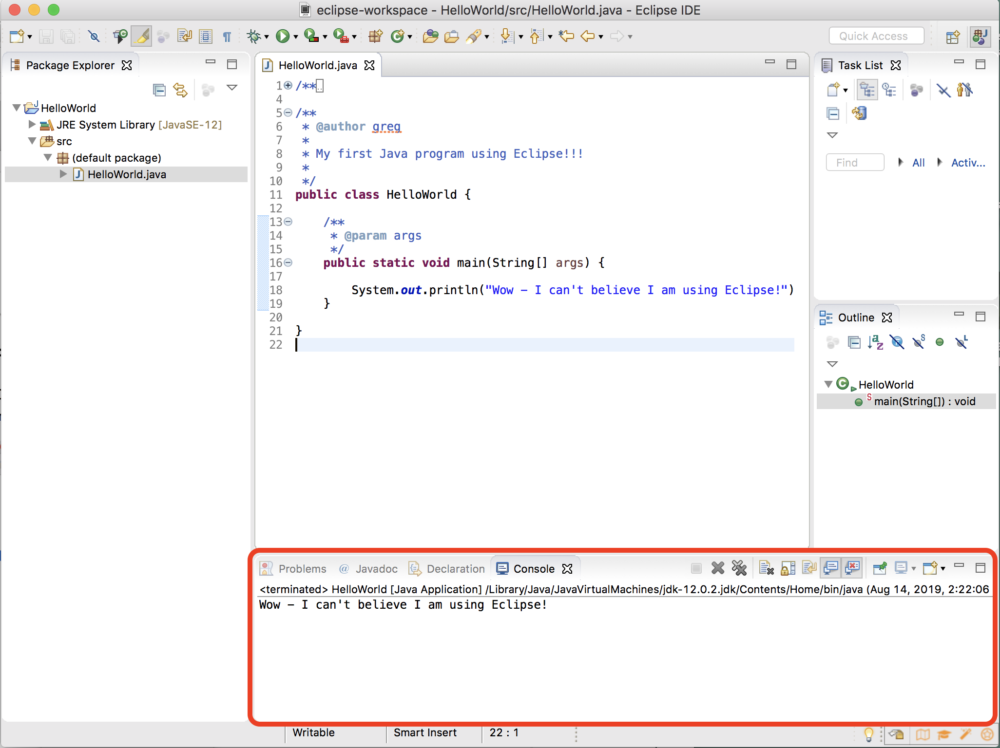

<link rel="stylesheet" href="http://people.westminstercollege.edu/faculty/ggagne/styles.css">

Introduction to Eclipse

### Using Eclipse

This provides an overview of using Eclipse for Java development. Be sure to have downloaded the latest version of the JDK for you appropriate operating system.
These instructions show screenshots taken using OS X, but apart from a few minor differences, they will appear the same on any computer system.

### Workspace

An Eclipse **workspace** is a folder on your local filesystem where Java source and compiled .class files are stored. When you start Eclipse, it will ask you for the location of your workspace - usually the default location is sufficient.

### Projects

Eclipse works by setting up a project for each Java program you wish to run. (Don’t confuse programs with classes, a project can and usually will have multiple classes.) Each project has its own folder in the Eclipse workspace.

Every separate Java program (i.e. labs/homework) should have its own project.

Create a new project by choosing **File -> New -> Java Project**

You will be shown the following window. (I named my project **HelloWorld**)

Following the creation of your project, you *may* be presented with window asking you to create a Java module. **Do not create a Module**.

### Creating a Class

A Java project is a repository for one or more Java class (source) files. 

To create a new class, enter **File -> New -> Class** and the following window will appear:

I have named my class file `HelloWorld` (the class does not have to match the name of the project - in fact, a typical Java project will have multiple Java class files.)

I also have chosen to click the box that creates the  `main()` method, as well as the box for generating comments.

One of the best features of Eclipse is that it does a lot of the busywork for you - quite often creating *stub* (empty) classes. In the example below, Eclipse has automatically create a stub `main()` method, as well as creating space for writing comments:

### Compiling

An interesting thing about Eclipse is that it auto-compiles for you as you type. If you have a compile error, Eclipse will indicate with a red X on the line where the error occurs. (Ugh, I always forget those pesky semi-colons!)

### Running Your Program

Once your program is compiling correctly, you  can run it by highlighting the class that contains the `main()` method, and right-clicking (control-click for macOS folks) on that file in the **package explorer** window:

Choose **Run As -> Java Application**. You should see the output in the Console window at the bottom of the Eclipse application.

### Odds and Ends

There are numerous other issues this document does not cover, and Eclipse is a rather complicated piece of software to use at times. Be patient, ask others, and be patient. After a few weeks you will be comfortable using Eclipse, and will appreciate the power of Java software development on this platform.

