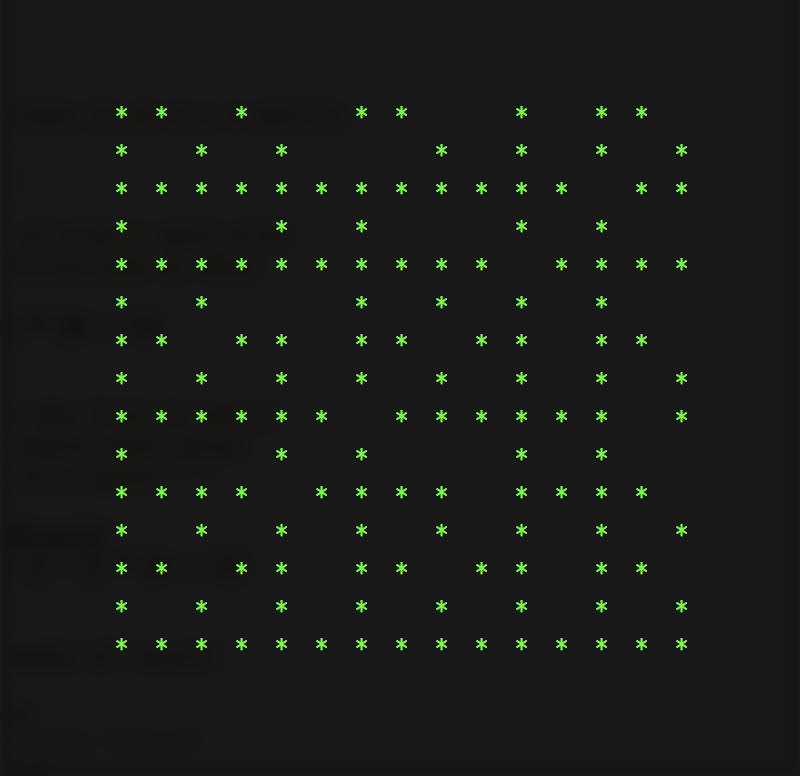

<link rel="stylesheet" href="http://people.westminstercollege.edu/faculty/ggagne/styles.css">

CMPT 202 Homework #1 Co-Primes

### Due: By 5 pm Friday August 30

### Overview

Two numbers are said to be *co-prime* if their only common factor is 1. For example, 4 and 9 are co-prime as their only common factor is 1. However, the numbers 4 and 10 are not co-prime. (Co-prime numbers are also referred to as *relatively prime*.)

This assignment will involve writing a Java program that is passed two values M and N, and it will determine all the co-prime pairs between (1,1) and (M,N). It will present these co-primes by outputting them as a grid. For example, the following displays the co-prime pairs of of M = 15 N = 15:

where an asterisk represents a co-prime pair. The following image shows the relative positions of each pair (notice that (1,1) is the lower left-hand corner) where the blue circle is the co-prime pair (4,9), and the yellow circle indicates (4,10) is not co-prime.

### Assignment

Write a Java program that is passed two parameters representing the pairs to generate. Use the following program as a starting point:

- [CoPrimes.java](./CoPrimes.java)

This program expects two parameters passed on the command line. These are the values passed to the `args[]` parameter in the `main()` method.

Using Eclipse, parameters are passed to Java programs by the following steps:

**Run As -> Run Configurations**

followed by

Modify `CoPrimes.java` so that it displays the co-primes as shown in the above figures (that is, an '*' if the coordinates (i,j) represent a co-prime, or a space if (i,j) is not a co-prime pair.) Make sure your display begins with the pair (15,1) in the first line, and ends with th pair (1,1) in the last line. (This should present a relatively minor challenge.)

### Hint

Consider how the Euclidean method of determining the greatest common divisor may be helpful at solving this problem.

### Submission

Submit your implementation of `CoPrimes.java` to Canvas by 5 pm on Friday August 30. There is a grading rubric on the Canvas dropbox for this assignment. Notice this rubric includes 5 points for coding style. Refer to [Program Grading Guidelines](http://www.people.westminstercollege.edu/faculty/ggagne/gradingpolicy/index.html) for proper comments and coding style.
