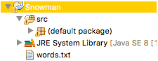

<link rel="stylesheet" href="http://people.westminstercollege.edu/faculty/ggagne/styles.css">
<p id="header">CMPT 202 Homework #2<br>Snowman</p>

### Due: By 9:00 AM Monday September 16, 2019

### Overview

Snowman is a fun spelling game whereby the computer chooses a random word, and the player must guess it within 6 tries. For each incorrect guess, a new part of the snowman is constructed. If the player cannot correctly guess the word within 6 tries, an entire snowman is completed, and the player loses. The player wins if they guess the word within 6 tries. (For some odd reason the player loses if they can build a snowman.) 


### Specifics

Write a program that plays basic snowman. The computer will choose a word at random from a dictionary of possible words. 

This program can be written in any style you choose. One simple strategy of the output is as follows: The letter selected by the player appears following the message `Select a letter:`

```
_ _ _ _ _ _

Incorrect guesses = 0

Select a letter: a

_ a _ _ _ _

Incorrect guesses = 0

Select a letter: t

t does not appear

_ a _ _ _ _

Incorrect guesses = 1

Select a letter: s

_ a _ _ _ s

Incorrect guesses = 1

Select a letter: m

m does not appear

_ a _ _ _ s

Incorrect guesses = 2
```
and so forth. At the conclusion of the game, output whether the player eiher won or lost:

```
c a p e r s

        Congratulations - you won!
```

or

```
 _ a p _ _ s

        Incorrect guesses = 6

        I'm sorry, you lost! The word was c a p e r s
```

### How to Begin

A starting point for this program is as follows:

- [Snowman.java](./Snowman.java)

which reads in the following textfile

- [words.txt](./words.txt)

Be sure to set up your Eclipse project similar to what is shown below. Otherwise the program `Snowman.java` will be unable to find the file `words.txt` 





### Specifics

- Your program should be case-neutral: 'a' is the same as 'A'.

- Perform some basic error checking:

	- If the player enters a character other than 'a ... z' or 'A ... Z' you simply ignore the input value and prompt again. (In other words, if they enter '$' as a character, you do not check to see if it occurs in the word, nor do you count it against one of their guesses.
	
	- Check if the player enters a letter they have already guessed. In this case report they have already guessed that letter. Duplicate incorrect guesses do not count once towards the number of incorrect guesses.


### Submission

Submit your solution to Canvas by the due date. There is a grading rubric on the Canvas dropbox for this assignment. Notice this rubric includes 5 points for coding style. Refer to [Program Grading Guidelines](http://www.people.westminstercollege.edu/faculty/ggagne/gradingpolicy/index.html) for proper comments and coding style.
