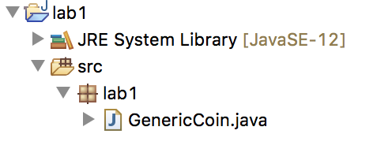
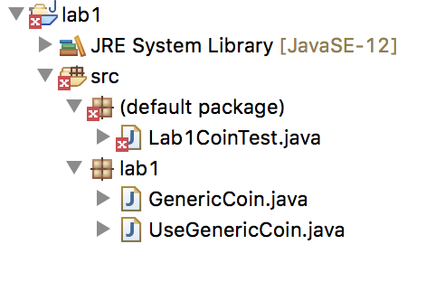
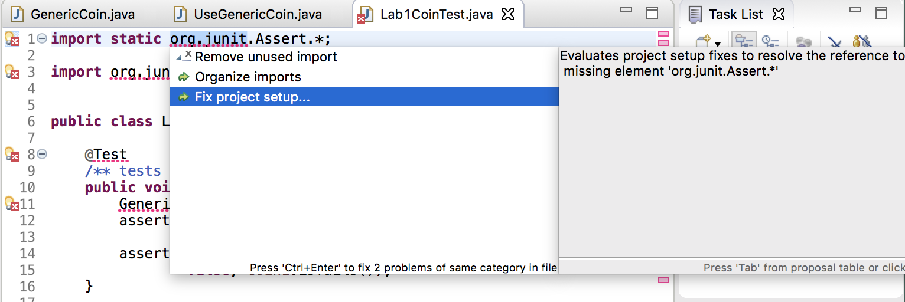
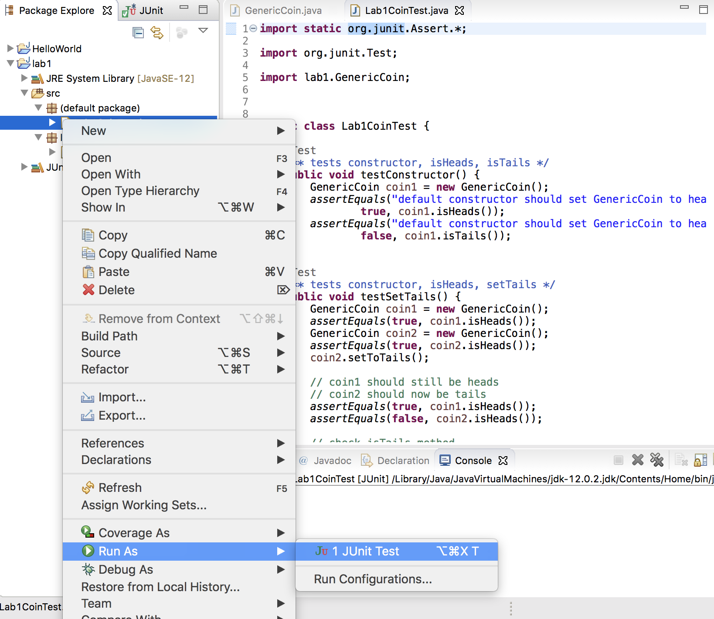

<link rel="stylesheet" href="http://people.westminstercollege.edu/faculty/ggagne/styles.css">
<p id="header">CMPT 202 Lab 1 <br>Java Refresher</p>

### Due: By the Start of the Next Lab Period

### How Labs are Managed and Graded

1. Select a partner on your own. The rules are you must pair with a new partner each week.
2. Work as a pair to complete the lab. At the end of the lab period, make sure to share all files with each partner.
3. Each partner will submit the lab separately. 
4.  If you do not finish the lab during the lab period, you may either get together outside of class to complete it, or complete it on your own. If you choose to complete it on your own, be sure to indicate this in your submission. 

### Objectives

The objectives of this lab are:

1. To review the Java language.
2. To experiment with enumerated data types.
3. To run unit tests to verify your Java classes work correctly.
4. To apply some principles of programming and software engineering.

### Overview

This lab will involve designing a class called `GenericCoin` that allows you to flip a coin. You will test your implementation using a provided unit test, and then write additional Java code that uses your `GenericCoin` class.


### Create a lab1 Project

Create a new Eclipse project named **lab1** (case-specific).

### Create a GenericCoin Class

Create a new Java class called `GenericCoin`. Do not provide a `main()` method in this class (you will do so in another class.)

Initially this class will be empty apart from some basic stub code provided by Eclipse. Your project explorer should appear as follows:



Add some comments to your class including your name, date, and brief description what the class does:

```java
/**
 * @author Greg Gagne
 * @date August 2019
 * 
 * This class provides the functionality of a generic coin
 * that maintains the the side (heads or tails0 of the coin.
 */
 
 public class GenericCoin
 {
 . . .
 }
```

Your class will maintain the side (heads/tails) using an **enumerate** data type:

```java
public enum CoinSide {HEADS, TAILS};
```

For your instance variable,  use this enumeration type `CoinSide`. You should declare a `CoinSide` instance variable in the same way that you would declare any other instance variable. However, this object can only have two values, `CoinSide.HEADS` and `CoinSide.TAILS`.

Usage Examples

```java
public enum CoinSide {HEADS, TAILS}; 	// CoinSide is a new data type

private CoinSide side;					// side is of type CoinSide

```

```java
side = CoinSide.HEADS;					// sets side to HEADS
```

```java
if (side == CoinSide.TAILS) {
	// some logic if side is set to tails ...
}
```

Your `GenericCoin` class must have the following methods (be sure to use these method signatures!)

* A default constructor that initializes the side to heads

* Three mutators:
	* `public void setToHeads()` that sets the coin to heads
	* `public void setToTails()` that sets the coin to tails
	* `public void toss()` that randomly sets the coin to heads to tails. Use `java.lang.Math.random()` to set the coin to heads 50% of the time, and tails 50% of the time.

* Three accessors:
	* `public boolean isHeads()` returns true if coin is set to heads
	* `public boolean isTails()` returns true if coin is set to tails
	* `public String toString()` returns the String "Heads" or "Tails" based on the side of the coin.

	
Be sure to comment your code as you develop it.

### Test Your Implementation

Test your implementation of `GenericCoin` using the supplied unit tests:

[Lab1CoinTest.java](./Lab1CoinTest.java)

Right-click these unit tests and download them. Next, drag this file to the **src** folder of your lab1 project. The project explorer should appear as follows:

 
 
You should notice there is an error associated with you unit test. If this occurs, click on the 'X' next to one of the `import` statements. The following dialog box will appear. Double-click on **Fix project setup**




The following dialog box will then appear which allows you to add the Junit 4 library to your build path. This should resolve any errors.

Run your unit test by right-clicking on the unit test file, and selecting **Run As -> JUnit**:



If your `GenericCoin` class works properly, you should see the green output. Red indicates an error. Be sure to fix all logic errors before proceeding to the next step.

### Write a Separate Class that Uses GenericCoin

Write a separate class with a `main()` method that uses your `GenericCoin` class. Name this class `UseGenericCoin.java`. You may place all logic in the `main()` method of this class.

Initially, create two `GenericCoin` objects and toss both coins 100 times each. Next, report the percentage of heads for each coin. You output will be similar to what is shown below:

```
Coin 1 landed on heads 48.0% of the time.
Coin 2 landed on heads 44.0% of the time.
```

Next, report which coin landed upon heads most often, and output the difference between the number of heads of the two coins. As an illustration, your program would print **one** of the following example outputs: 

```
The first coin was heads 3 more times.

The second coin was heads 7 more times.

Both coins had the same number of heads.
```

### Extra Time? Write a Game for Extra Credit

Create a new program called `CoinGame.java` that asks the user to guess whether the coin will be heads or tails. Then, flip the coin and report the results of the  coin toss. Provide fun messages if the user guesses correctly or not! Repeat until the user is done playing the game.

After the user is done, report the number of coin tosses, and how many times the user guessed correctly. Also include the percentage of correct guesses.

The `java.util.Scanner` class is a good choice for capturing user input.

### Lab Submission

At the completion of the lab period, be sure to share the Java files with your partner. This ensures both partners have all necessary files. **Both** lab partners must upload the following files to the Canvas dropbox for Lab 1:

* `GenericCoin.java`
* `UseGenericCoin.java`
* `CoinGame.java` (if you completed this step.)

A rubric will be provided for the Canvas dropbox for this lab.

