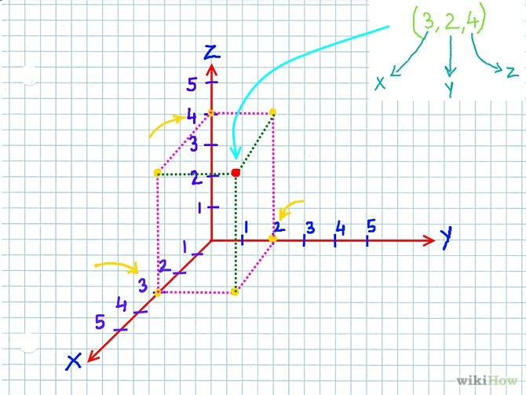
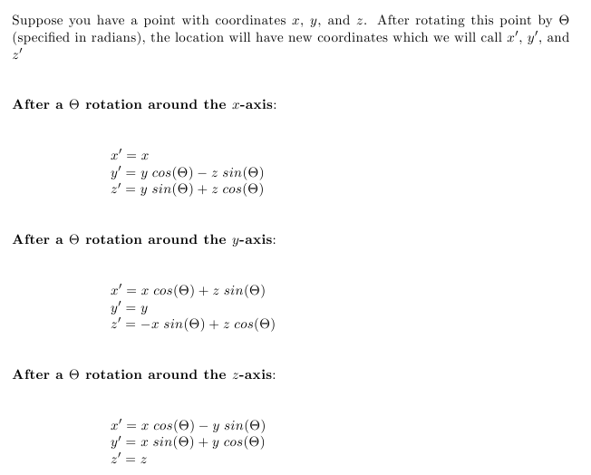

<link rel="stylesheet" href="http://people.westminstercollege.edu/faculty/ggagne/styles.css">

CMPT 201 Lab 2  Three Dimensional Points

### Due: By the start of the next lab period

### How Labs are Managed and Graded

1. Select a partner on your own. The rules are you must pair with a new partner each week.
2. Work as a pair to complete the lab. At the end of the lab period, make sure to share all files with each partner.
3. Each partner will submit the lab separately. 
4.  If you do not finish the lab during the lab period, you may either get together outside of class to complete it, or complete it on your own. If you choose to complete it on your own, be sure to indicate this in your submission. 

### Objectives

The objectives of this lab are:

1. To continue your review of the Java langauge
2. To use methods in the `java.lang.Math` API
3. To design and run unit tests
4. To apply some principles of programming and software engineering

### Overview

This lab will involve designing and implementing a Java class that represents a three-dimensional point.

###  Overview 

Create a new Eclipse project named **lab2** (case-specific).

The following image represents a three-dimensional point with an x, y, and z coordinates:

### The Lab

Design a class named `ThreeDimensionalPoint` that represents a three-dimensional point that has a specified x, y, and z coordinates. These coordinates should be stored as a `double`.

1. Provide two constructors
	* a default constructor that sets the origin at (0,0,0)

	* a constructor that allows the `(x, y, z)` coordinates to be specified.

2. A getter method for the x, y, and z coordinates:
	* `getX()`, `getY()`, and `getZ()`

The following steps require implementing specific methods. For each of these methods, first write the stub of the method (i.e. it just compiles, but provides no functionality). Then, write an appropriate unit test for the method. You should initially fail your unit tests. Next, implement the method. Repeat this process for each of the six methods. This is the process behind test-driven development (TDD).

Provide three methods that allow the specified point to be shifted by a specified amount along the axis:

- `double shiftX(double amount)`

- `double shiftY(double amount)`

- `double shiftZ(double amount)`

Each method returns the new position of either the x, y, or z coordinate.

Provide three methods that will allow the rotation of a point by a specified angle around a specified axis. This will require a bit of trigonometry:

Look at the Java API on how to use the `sin()` and `cos()` methods. (They are simple and easy to use.)

These three methods will have the following signatures:

- `void rotateX(double theta)`

- `void rotateY(double theta)` 

- `void rotateZ(double theta)`

Once you have performed the appropriate rotation, be sure to update the values of x, y, and z to their new values.

When you write these unit tests, you will likely need to perform some of the math using a calculator to first determine what the correct values of x, y, and z are following a rotation. You will also have to think about the value of delta for the `assertEquals()` where you are asserting two double values have the same value. (The delta value is the threshold you are allowing the two variables to vary where you still assert they are equals.)

For example, if 

`v1 = 5.45` and `v2 = 5.5` and `delta = .05` 

then

`assertEquals(v1,v2,delta)` 

will return `true`.

### Lab Submission

At the completion of the lab period, be sure to share the Java files with your partner. This ensures both partners have all necessary files. **Both** lab partners must upload the following files to the Canvas dropbox for Lab 2:

* `ThreeDimensionalPoint.java`
* Your unit tests

A rubric will be provided for the Canvas dropbox for this lab.

